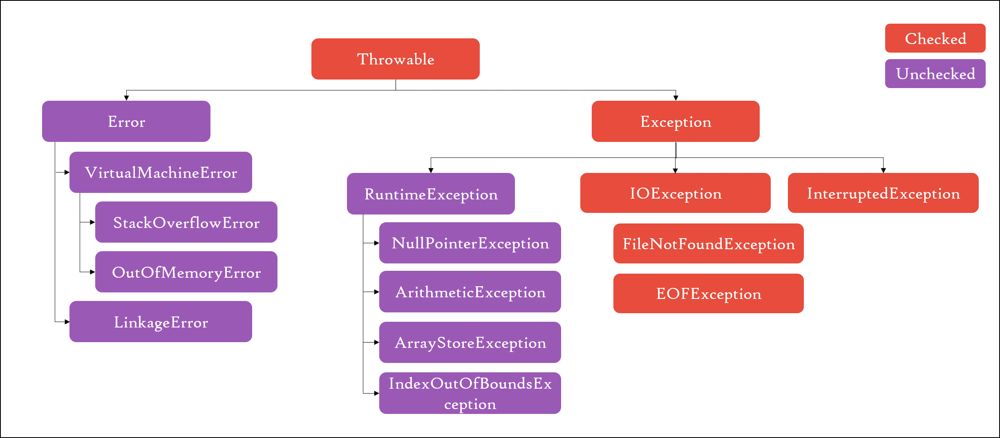

# Session 10

## Table of Contents
1. [Exception Handling](#exceptions)
    1. [The Exception Hierarchy](#hierarchy)
    2. [Checked and Unchecked Exceptions](#checked-unchecked)
    3. [`throw` and `throws`](#throw-throws)
    4. [try-catch-finally](#tcf)
    5. [Variants of try-catch-finally](#tcf-variants)
    6. [Some "Exceptional" Cases](#tcf-cases)
2. [Garbage Collection](#gc)
    1. [The Garbage Collector](#gc-core)
    2. [The `finalize` method](#finalize)
3. [Heaps](#heaps)
4. [Assignments](#assignments)
    1. [HackerRank](#hackerrank)
    2. [Miscellaneous](#miscellaneous)

### <a name="exceptions"></a>Exception Handling

The Java programming language uses exceptions to handle errors and other exceptional events.

An exception is an event that occurs during the execution of a program that disrupts the normal flow of instructions.

#### <a name="hierarchy"></a>The Exception Hierarchy

All exception and error implementations occur under the [`Throwable`](https://docs.oracle.com/javase/7/docs/api/java/lang/Throwable.html) class in Java.



#### <a name="checked-unchecked"></a>Checked and Unchecked Exceptions

Exceptions in Java have been partitioned into two types; checked and unchecked exceptions.
Checked exceptions are checked by the *compiler*, in that if a method throws a checked exception, then it must either handle it using a [try-catch](#tcf) block, or explicitly declare it to be thrown using the [`throws`](#throw-throws) keyword.

Unchecked exceptions are not checked by the compiler, and so the code that raises such an exception is not bound by any additional constraints.

Everything under the `RuntimeException` and `Error` classes are unchecked. Everything other exception is checked.

[While the intent behind categorizing these two was good](https://docs.oracle.com/javase/tutorial/essential/exceptions/runtime.html), it is currently considered an overhead. There is a large set of programmers in the world, who believe that Java should have only unchecked exceptions.

In general, the guideline for deciding whether an exception you are making should be checked or unchecked is:
1. If the client using your API/library/code can recover from an exception thrown by your code, it should be checked.
    For instance, if your library allows a connection to Instagram, but limits the number of connections, and throws a "TooManyConnectionsException", the client/user can close an existing connection (in a catch block), and retry.
2. If there is no possibility of recovery, use an unchecked exception, i.e. extend from [`RuntimeException`](https://docs.oracle.com/javase/7/docs/api/java/lang/RuntimeException.html).
    For instance, if your aforementioned library fails because the Instagram server is down, there is hardly anything that the user can do to recover from this.
    Unchecked exceptions should also be used to indicate incorrect usage of an API. For example, if the client code passes null arguments to your `authenticate` method, or something similar, you can, and should throw an [`IllegalArgumentException`](https://docs.oracle.com/javase/7/docs/api/java/lang/IllegalArgumentException.html), which is unchecked.

#### <a name="throw-throws"></a>`throw` and `throws`

The `throw` keyword is used to, unsurprisingly, throw an exception. Continuing the example from above:

```java
class InstagramClient {
    ...

    public void authenticate(String clientKey, String clientPassword) {
        if (clientKey == null) {
            throw new IllegalArgumentException("clientKey cannot be null!");
        }

        if (clientPassword == null) {
            throw new IllegalArgumentException("clientPassword cannot be null!");
        }
        ...
    }
}
```

The `throws` keyword is used in a method declaration, to declare to the caller that this method throws a checked exception. You have already seen an example of this:

```java
public static void main(String[] args) throws IOException {
    BufferedReader br = new BufferedReader(new InputStreamReader(System.in));

    // Check the documentation for readLine method of BufferedReader
    // You'll see that it declares
    String s = br.readLine();
}
```

Since [`IOException`](https://docs.oracle.com/javase/7/docs/api/java/io/IOException.html) is a checked exception, it must be declared to be thrown by the method.

If you check the documentation for [readLine](https://docs.oracle.com/javase/7/docs/api/java/io/BufferedReader.html#readLine() method of BufferedReader, you'll see that it declares that it throws IOException.

#### <a name="tcf"></a>try-catch-finally

Since we've been reading about things being thrown around, there is an obvious construct to "catch" these exceptions.

The try-catch block allows you to "try" to execute a piece of code, and if an exception is thrown, you "catch" it, and either try to recover from it, or fail gracefully.

The following is an overused, yet simple example for using try-catch

```java
class ArithmeticExceptionExample {
    public static void main(String[] args) {
        Scanner sc = new Scanner(System.in);
        int a = sc.nextInt();
        int b = sc.nextInt();

        int c = divide(a, b);
    }

    public int divide(int a, int b) {
        int x;
        try {
            // b could be 0!
            x = a / b;
        }
        catch (ArithmeticException ae) {
            System.out.println(ae);
            return 0;   // Does not make sense to return 0, but what can you do :P
        }
        return x;
    }
}
```

The `finally` block is ALWAYS executed, regardless of whether a try is successful or not.

For example:

```java
try {
    System.out.println("In try block");
    throw new IOException("Good example for try-catch not found!");
}
catch (IOException ioe) {
    System.out.println("In catch block");
}
finally {
    System.out.println("In finally block");
}
```

will print:
```
In try block
In catch block
In finally block
```

and

```java
try {
    System.out.println("In try block");
}
catch (IOException ioe) {
    System.out.println("In catch block");
}
finally {
    System.out.println("In finally block");
}
```

will print:
```
In try block
In finally block
```

Remember that the `finally` block is **ALWAYS** executed.  
When is it executed? **ALWAYS**.

#### <a name="tcf-variants"></a>Variants of try-catch-finally

There are several possible variations of try-catch-finally, not all of which are correct. The following sections attempts to cover all of them, clearly specifying whether it is valid or invalid.

##### Valid
1. Simple try-catch
```java
try {

}
catch (IOException e) {

}
```

2. Simple try-catch-finally
```java
try {

}
catch (IOException e) {

}
finally {

}
```


#### <a name="tcf-cases"></a>Some "Exceptional" Cases

#### <a name="joke"></a>Bonus: A Lame Joke

### <a name="gc"></a>Garbage Collection

#### <a name="gc-core"></a>The Garbage Collector

#### <a name="finalize"></a>The `finalize` method

### <a name="heaps"></a>Heaps

### <a name="assignments"></a>Assignments

#### <a name="hackerrank"></a>HackerRank
1. https://www.hackerrank.com/challenges/java-exception-handling-try-catch
2. https://www.hackerrank.com/challenges/java-exception-handling

#### <a name="miscellaneous"></a>Miscellaneous
